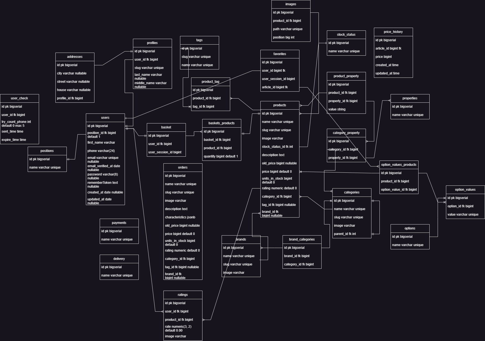

# Phone shop admin panel

Админ панель для магазина электроники **phoneshop**.

Функции:
=
+ Регистрация/Авторизация/Восстановление пароля
+ Хеширование
+ Email рассылки
+ Статистика магазина
+ Поиск
+ Информация о пользователях
+ Разграничение доступа(admin, moder, regular)
+ CRUD операции c:
  + пользователями
  + товарами
  + категориями
  + брендами
  + тегами

Используемый стек:
=
+ PHP 8.1
+ Laravel 9
+ Blade
+ PostgreSQL 14
+ jquery
+ SASS
+ JS plugins - moment, datatables, daterangepicker, select2, overlayScrollbars, inputmask
+ Vite

Модели реализуемые в БД(таблицы и поля):

Команды cache:
=
  - php artisan config:cache, php artisan config:clear
  - php artisan route:cache, php artisan route:clear
  - php artisan view:cache
  - php artisan optimize

1. Изменить ImageConvertToWebp